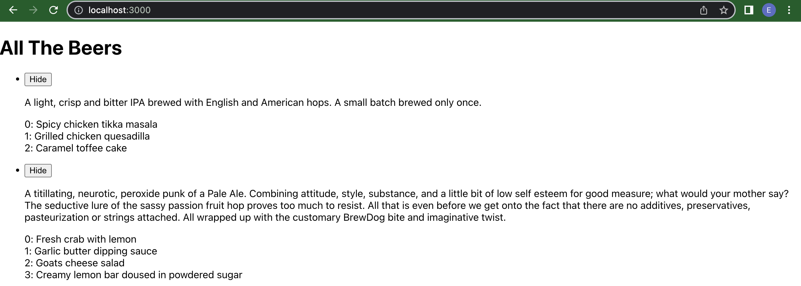

# Beer API

1. Create a new file in the /src folder called Beers.js

2. Import the new Beers.js file in the App.js file `import { Beers } from './Beers';`

3. Since we'll be displaying the data in Beers.js through App.js, we want to `return()` the `<Beers>` component by adding this code to App.js:

```javascript
  return (
    <div>
      <h1>All The Beers</h1>
      <Beers></Beers>
    </div>
  );
  ```

  Note: Make sure you add `export default App;` on the last line

  The entire App.js file should look like this:

```javascript
import React from 'react';
import { Beers } from './Beers';

function App() {
  return (
    <div>
      <h1>All The Beers</h1>
      <Beers></Beers>
    </div>
  );
}

export default App;
```

Note: We will be making the API call within Beers.js.  Also, we will be removing the App.css file because we aren't styling anything in this lesson.

4. In Beers.js, we have to first import react `import React from 'react';` then create the Beers function `function Beers(){}` and export the Beers component at the very bottom: `export { Beers };`

5. To test that you've linked your Beers and App components, add `return(<div>Hello World</div>)` inside the Beers function, and do `npm start` in your beer-api directory to see "Hello World" show up on the UI. This means you've added the files and code correctly. If you're seeing errors, repeat steps 1-4.

6. Now we'll add our API call. We have to import the useState and useEffect hooks on the first line, so edit the React import line to this: `import React, { useState, useEffect } from 'react';`

7. Import axios on the second line: `import axios from 'axios';` and run `npm i axios --save` in Terminal if you haven't already.

8. Within the Beers function, add your variables: `const [beers, setBeers] = React.useState(null);`

9. The following code will make the call to the Beers API, and will also initalize the visibility state for each item:

```javascript
    useEffect(() => {
      axios.get('https://api.punkapi.com/v2/beers')
          .then((data) => {
            const allData = data.data;
            console.log(allData)
            setBeers(allData)
            // Initialize the visibility state for each item
            const initialVisibility = {};
            allData.forEach((item) => {
                initialVisibility[item.id] = true;
            })
            setVisibility(initialVisibility);
          })
    }, []);
  
    if (!beers) {
        return <div>Loading...</div>;
    }
```

10. Within the return, we can now map over the `allData` variable and see the description data on the UI. We'll create an unordered list and each beer will be a list item with a unique key on the UI.

```javascript
    return(
        <ul>
            {beers.map((item) => (
                <li key={item.id}>{item.description}</li>))}
        </ul>
    )
```

11. In order to add a button to each list item:

```javascript
    <button onClick={() => toggleVisibility(item.id)}>
        {visibility[item.id] ? "Hide" : "Show"}
    </button>
```

Add an HTML button tag, with an onClick event and call a toggleVisibility function (which we will write in the next step)

12. Set your visibility variables and add this line under your beer variables inside your Beers function: `const [visibility, setVisibility] = useState({});` below this, add your toggleVisibility function.

```javascript
    const toggleVisibility = (id) => {
        setVisibility({
          ...visibility,
          [id]: !visibility[id],
        });
    };
```

This function takes in the id of each list item from the UI and calls the setVisibility function, then it will determine whether setVisibility is true or false, and it will set it to the opposite state.

13. To add this to the UI, add the follwing code below the button tag within the `return()`:

```javascript
    {visibility[item.id] && 
        <div>
            <p>{item.description}</p>
        </div>
    }
```

14. Last step - in order to loop around a nested object, use `Object.entries(whatever.the.object.is).map()`:

```javascript
{Object.entries(item.food_pairing).map(([k, value]) => (
    <div key={item.id}>{k}: {value}</div>
))}
```

Here we've chosen the Food Pairing list within the beers object API to list out food pairings for each beer within the same entry. The entire `return()` statement should look like this now:

```javascript
    return(
        <ul>
            {beers.map((item) => (
                <li key={item.id}>
                    <button onClick={() => toggleVisibility(item.id)}>
                        {visibility[item.id] ? "Hide" : "Show"}
                    </button>
                        {visibility[item.id] && 
                            <div>
                                <p>{item.description}</p>
                                <p>{Object.entries(item.food_pairing).map(([k, value]) => (
                                    <div key={item.id}>{k}: {value}</div>
                                ))}</p>
                            </div>
                    }
                </li>
            ))}
        </ul>
    )
```

`localhost:3000` should look something like this:



## Getting Started with Create React App

This project was bootstrapped with [Create React App](https://github.com/facebook/create-react-app).

## Available Scripts

In the project directory, you can run:

### `npm start`

Runs the app in the development mode.\
Open [http://localhost:3000](http://localhost:3000) to view it in your browser.

The page will reload when you make changes.\
You may also see any lint errors in the console.

### `npm test`

Launches the test runner in the interactive watch mode.\
See the section about [running tests](https://facebook.github.io/create-react-app/docs/running-tests) for more information.

### `npm run build`

Builds the app for production to the `build` folder.\
It correctly bundles React in production mode and optimizes the build for the best performance.

The build is minified and the filenames include the hashes.\
Your app is ready to be deployed!

See the section about [deployment](https://facebook.github.io/create-react-app/docs/deployment) for more information.

### `npm run eject`

**Note: this is a one-way operation. Once you `eject`, you can't go back!**

If you aren't satisfied with the build tool and configuration choices, you can `eject` at any time. This command will remove the single build dependency from your project.

Instead, it will copy all the configuration files and the transitive dependencies (webpack, Babel, ESLint, etc) right into your project so you have full control over them. All of the commands except `eject` will still work, but they will point to the copied scripts so you can tweak them. At this point you're on your own.

You don't have to ever use `eject`. The curated feature set is suitable for small and middle deployments, and you shouldn't feel obligated to use this feature. However we understand that this tool wouldn't be useful if you couldn't customize it when you are ready for it.

## Learn More

You can learn more in the [Create React App documentation](https://facebook.github.io/create-react-app/docs/getting-started).

To learn React, check out the [React documentation](https://reactjs.org/).

### Code Splitting

This section has moved here: [https://facebook.github.io/create-react-app/docs/code-splitting](https://facebook.github.io/create-react-app/docs/code-splitting)

### Analyzing the Bundle Size

This section has moved here: [https://facebook.github.io/create-react-app/docs/analyzing-the-bundle-size](https://facebook.github.io/create-react-app/docs/analyzing-the-bundle-size)

### Making a Progressive Web App

This section has moved here: [https://facebook.github.io/create-react-app/docs/making-a-progressive-web-app](https://facebook.github.io/create-react-app/docs/making-a-progressive-web-app)

### Advanced Configuration

This section has moved here: [https://facebook.github.io/create-react-app/docs/advanced-configuration](https://facebook.github.io/create-react-app/docs/advanced-configuration)

### Deployment

This section has moved here: [https://facebook.github.io/create-react-app/docs/deployment](https://facebook.github.io/create-react-app/docs/deployment)

### `npm run build` fails to minify

This section has moved here: [https://facebook.github.io/create-react-app/docs/troubleshooting#npm-run-build-fails-to-minify](https://facebook.github.io/create-react-app/docs/troubleshooting#npm-run-build-fails-to-minify)
